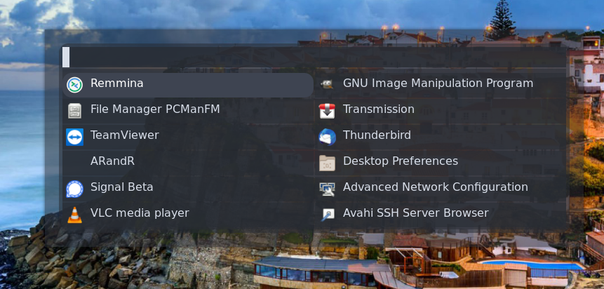

# My i3 Setup

What we have here is my latest i3 config for my workstation. I am depreciating my old workstation config and making an entirely new github repo for each machine I own due to the monitors changing everytime I run a git push and git pull. This setup also now has a script that will get rid of any current .config/i3, etc., configs and place them in a temp folder. It will them symobolically link from my github pulled repo to their respective location in my home folder. It will them erase the temp folder if everything is working correctly. 

#### Pics
Here are some pictures of my screen using scrot. The wallpapers are of one my favorite places in the world, Portugal.

Rofi

i3Blocks

# Colors
[https://htmlcolorcodes.com/colors/](https://htmlcolorcodes.com/colors/)
#### Prerequirements

* arch (but might work with other distros)
* i3-gaps (Like i3 but with gaps)
* i3blocks (Top Menu Bar)
  * NetworkManager (Needed for nm-vpn Blocket)
  * networkmanager-openvpn
  * perl-json (Needed for weather_NOAA Blocklet)
* vim (My personal favorite editor)
* feh (A simple but effective photo viewer and wallpaper setter) (Currently 0.43MB)
* urxvt-perls (Also my personal favorite terminal emulator once its been configured. Otherwise urxvt is ugly as crap)
* firefox (I swapped from Brave to Firefox due to Chrome and Chrome-clone security/privacy concerns)
* rofi (Program menu) (Currently only works with 1.6 version and NOT 1.7 version) [Go here to my blog on how to downgrade to 1.6 version](https://blog.wretchednet.com/post/rofi-broken/)
* dunst (Notification pop-up program) 
* scrot (For taking screenshots)
* screenfetch or neofetch (I prefer screenfetch but they mostly do the same thing, show hardware and other important info in the terminal)
* ttf-font-awesome (For all the cool image logos)
* ttf-dejavu (My standard font for everything else)
* gsimplecal (Simple GUI calendar)
* acpi (Only needed if you have a laptop)
* conky (Used to show clock on main screen)
* picom (Window transperancy and window shadow)
* redshift (Sets color screen and can be set on a schedule. Usually only for laptops)
* thunar or pcmanfm (Both are good file managers)
* voluemicon
* networkmanager-applet

#### Optional

* ttf-monoid (A great font for the terminal)
* lightdm (If you want a desktop manager greeter)
    * lightdm-slick-greeter (use my config in lightdm and place in /etc/lightdm/)
        * place background.jpg in /usr/share/pixmaps/

##### To-Be-Fixed

1. gsimplecal has a weird bug where it will stay popped-up even when you click off of it. Getting rid of it is as simple as hitting $mod+Shift+q when hovered over gsimplecal.
2. I have not updated my config for rofi to reflect the changes made from version 1.7. So to get the look of my rofi you need to lock down rofi to 1.6. My blog post above shows you how to do it on an Arch-based system.
